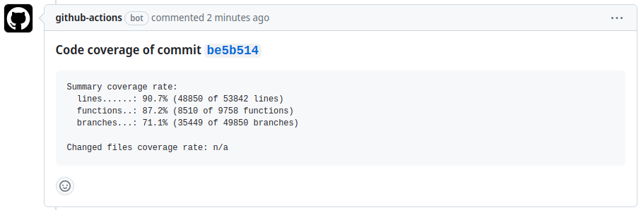
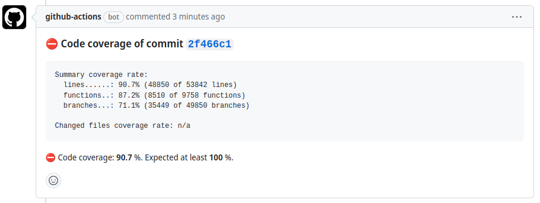
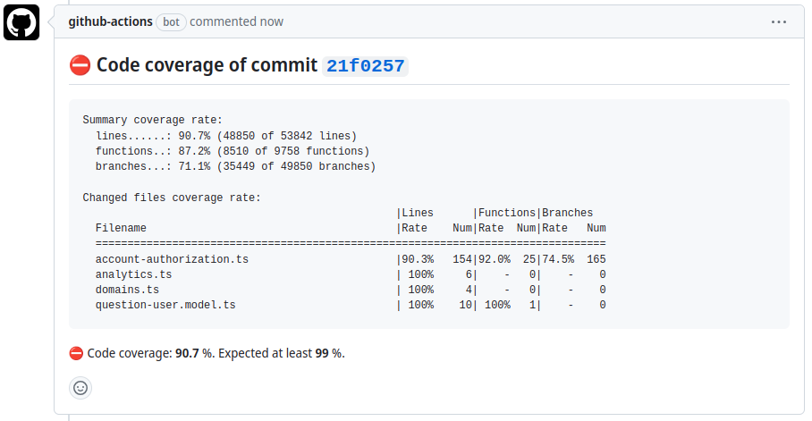

# Report code coverage

This GitHub Action reports code coverage from LCOV files. This action includes:

- commenting on a pull request
- generating an HTML report as an artifact
- failing if a minimum coverage is not met

[](https://github.com/pavelsaman/github-actions-report-lcov/actions/workflows/test-and-build.yml)

## Usage

### Inputs

- `coverage-files` (required): Coverage files to scan (e.g. `coverage/lcov.*.info`)
- `artifact-name` (optional): Name of generated coverage report artifact. Default is no artifact created.
- `minimum-line-coverage` (optional): Minimum % coverage to pass check. Default `0`.
- `minimum-branch-coverage` (optional): Minimum % coverage to pass check. Default `0`.
- `minimum-function-coverage` (optional): Minimum % coverage to pass check. Default `0`.
- `github-token` (optional): GitHub token to comment on PR.
- `working-directory` (optional): Directory containing source files. Default `./`
- `update-comment` (optional): Whether to update existing comment. Default `false`.
- `list-full-paths` (optional): Whether to list full file paths in details. Default `true`.

### Outputs

- `total-line-coverage`: Total line coverage
- `total-branch-coverage`: Total branch coverage
- `total-function-coverage`: Total function coverage

### Example usage

```yaml
jobs:
  coverage_report:
    name: Generate coverage report
    needs: test-job
    # Linux and macOS are supported
    runs-on: ubuntu-latest
    steps:
      - uses: actions/checkout@v3

      # if running on Windows, please install `lcov` here

      - name: Report code coverage
        uses: pavelsaman/github-actions-report-lcov@v4
        with:
          github-token: ${{ secrets.GITHUB_TOKEN }}
          coverage-files: coverage/lcov.*.info
          minimum-coverage: 90
          update-comment: 'true'
```

### Limitations

The action works out of the box with Linux and macOS runners. If you want to use it on Windows runners, please install `lcov` before running this action in a workflow.

## Example comments

When minimum coverage was reached or no minimum coverage was enforced:



When a check for minimum coverage fails:



Showing detailed coverage for changed files in the pull request:



## Contribution

Initial setup:

```bash
nvm use
make install
```

After source code changes, format, lint, and build the project with:

```bash
make build
```

Then push to remote.
Then create a new tag or move the latest tag.
